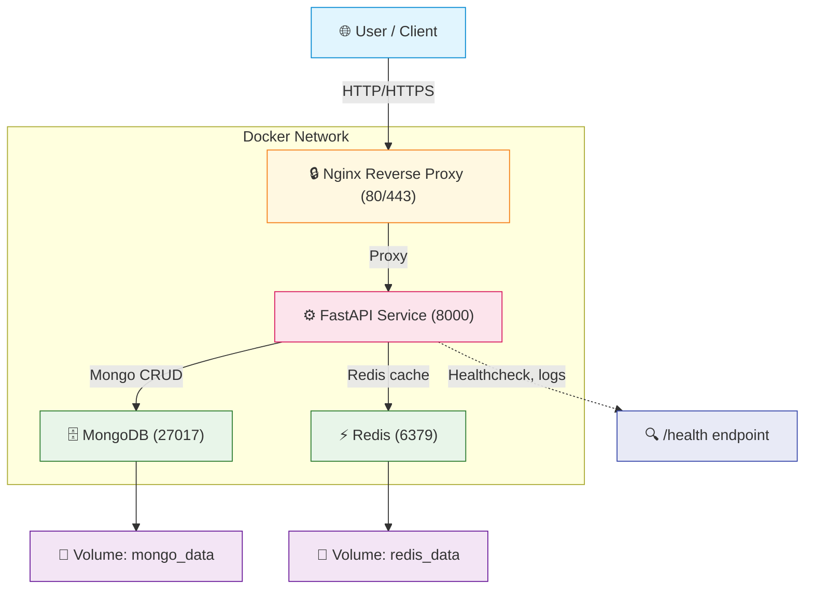

# TaskManagerApp 

Fully containerized FastAPI task manager app with MongoDB, Redis, and Nginx.

## 🧱 Architecture Overview



## 🔧 What’s included

- FastAPI application with auth, task CRUD, JWT token flow
- MongoDB (NoSQL database)
- Redis cache layer
- Nginx reverse proxy
- Docker Compose for dev and prod
- Health checks on all services
- Makefile commands for quick utility
- `.env.example` to get started

## 🚀 Run Locally

### Development

```bash
cd /Users/rohanmahakalkar/Desktop/FastAPIPro1
docker-compose -f docker-compose.dev.yml up -d
```

API access:
- http://localhost:8000

### Production

```bash
docker-compose up -d
```

API access:
- http://localhost/
- FastAPI directly at http://localhost:8001

## 📦 Commands

```bash
make dev          # start development stack
make prod         # start production stack
make build        # build containers
make logs         # view logs
make down         # stop container stack
make ps           # status
make test         # run tests
make db-shell     # mongodb shell
make redis-shell  # redis-cli
```  

## 🛠️ Architecture details

- `docker-compose.yml` - prod with nginx, redis, mongo
- `docker-compose.dev.yml` - dev with hot-reload
- `fastapi-learning/Dockerfile` - multistage (builder/runtime)
- `fastapi-learning/Dockerfile.dev` - dev image
- `nginx.conf` - proxy config
- `fastapi-learning/.env.example` - env template

## 📁 Files

- `fastapi-learning/main.py` - app routes
- `fastapi-learning/auth.py` - auth routes
- `fastapi-learning/tasks.py` - tasks router
- `fastapi-learning/database.py` - mongo connection
- `fastapi-learning/schemas.py` - pydantic models
- `fastapi-learning/tests/test_api.py` - integration tests

## 🔐 Notes

- Set secure `SECRET_KEY` in `.env`
- Protect `.env` in source control
- Add SSL certs in `ssl/` for Nginx HTTPS

## 📌 Git

```bash
git checkout -b main
git add .
git commit -m "Add root README with architecture and docs"
git push -u origin main
```
